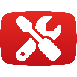

<p align="center"></p>

# TubeTweaks
Various enhancements for YouTube

## Current Features
- Prevent generating/loading trackable share links (Load prevention only available on Firefox)
- Change hostname of share links from youtu.be to www.youtube.com

## Note to Chrome/Chromium users
Due to Google's [ManifestV3 shenanigans](https://youtu.be/8KWCLhHrblE?t=206), functionality of this extension is severely limited on chromium-based browsers. 

TubeTweaks needs to intercept and modify network requests to work properly (similar to an ad blocker), which is no longer possible on Chromium.

Where possible, workarounds are implemented in the Chromium version. However, these may feel rather clunky. 

Where no workarounds are possible, the respective feature is removed.

If you want to use TubeTweaks to its full extent, please consider switching to Firefox!

## Download
[Firefox](https://addons.mozilla.org/en-US/firefox/addon/tubetweaks/)
Chromium coming soon!

## Building
```sh
yarn install
yarn build
```
